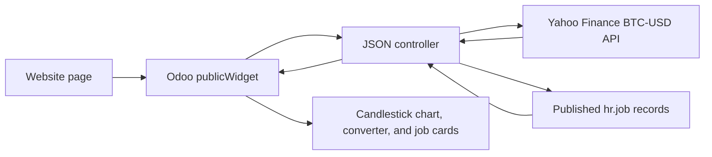

# Website Market Snippets


Custom Odoo 18 Community module that adds two Website Builder snippets:

- `Bitcoin Chart`: a Dynamic Content snippet that fetches BTC-USD OHLC prices through an Odoo JSON controller and renders a responsive candlestick chart with 1D, 7D, 1M, 6M, and 1Y ranges.
- `Random Jobs`: a Structure snippet that displays four random published Recruitment jobs on each page load, with department filters.

The module also loads sample departments and jobs, then publishes a preview page so the result can be checked immediately after installation.

## Output Preview

The screenshots below show the snippets after installation on a clean Odoo database. Both snippets are designed to remain usable across desktop, tablet, and mobile viewports.


### Bitcoin Chart

The Bitcoin Chart snippet displays BTC-USD candlestick price history with range controls, summary statistics, hover tooltips, loading and error states, and a two-way BTC/USD converter.


<details>
<summary>View date ranges, converter, and mobile screenshots</summary>

#### BTC/USD Converter


#### Mobile View


</details>

### Random Jobs

The Random Jobs snippet displays four random published Recruitment jobs with department filtering, job metadata badges, and a responsive card layout.


<details>
<summary>View department filters and mobile screenshots</summary>

#### Department Filter


#### Mobile View


</details>

## Tech Stack

- Odoo 18 Community
- PostgreSQL through Docker Compose
- Python controllers with public JSON routes
- Website Builder snippets and Odoo frontend widgets
- JavaScript ES modules
- SCSS frontend assets
- Recruitment and Website Recruitment modules

## Architecture



## Project Structure

```text
├── addons/
│   └── mplus_website_snippets/
│       ├── controllers/
│       │   ├── __init__.py
│       │   └── main.py
│       ├── data/
│       │   ├── departments.xml
│       │   └── sample_jobs.xml
│       ├── static/
│       │   └── src/
│       │       ├── js/
│       │       │   ├── bitcoin_chart.js
│       │       │   └── random_jobs.js
│       │       └── scss/
│       │           └── snippets.scss
│       ├── views/
│       │   ├── preview_page.xml
│       │   └── snippets.xml
│       ├── __init__.py
│       └── __manifest__.py
├── config/
│   └── odoo.conf
├── compose.yaml
├── .gitignore
└── README.md
```


## Prerequisites

- Docker Desktop with Docker Compose
- Git
- A modern web browser

## Installation

Clone the repository and enter the project directory:

```bash
git clone https://github.com/racheladita/odoo-website-snippets.git
cd odoo-website-snippets
```

Start the Odoo and PostgreSQL containers:

```bash
docker compose up -d
```

Open Odoo:

```text
http://localhost:8069
```

Create a new database using the following development credentials:

```text
Master password: admin
Database name: mplus
```

The master password is only intended for the local Docker development environment.

After creating the database, install the module from the command line:

```bash
docker compose exec web odoo -d mplus -i mplus_website_snippets --stop-after-init --no-http
docker compose restart web
```

Alternatively, update the Apps list and install `Website Market Snippets` from the Odoo Apps menu.

After installation, refresh the browser before opening Website Builder so the new views and frontend assets are loaded.

## Usage

Open Website Builder and add the snippets manually:

- `Bitcoin Chart` from `Dynamic Content`
- `Random Jobs` from `Structure`

A published preview page is also created during installation:

```text
http://localhost:8069/market-insights-careers
```

The same page is linked in the website navbar as `Market & Careers`.

If the local Odoo instance has multiple databases, open this first so the browser session uses the intended database:

```text
http://localhost:8069/web?db=mplus
```

## Endpoints

| Endpoint | Method | Purpose |
| --- | --- | --- |
| `/website_market_snippets/bitcoin_history` | POST JSON | Fetches and normalizes BTC-USD OHLC prices for the selected range. |
| `/website_market_snippets/random_jobs` | POST JSON | Returns up to four random published `hr.job` records, optionally filtered by department. |

## Data

Sample departments and jobs are loaded with `noupdate="1"`:

- `data/departments.xml`
- `data/sample_jobs.xml`

In Odoo data files, `noupdate="1"` means these seed records are installed once and are not overwritten by later module upgrades. This preserves administrator edits to the sample jobs during subsequent module upgrades.

The jobs are published on the website and assigned to departments so the Recruitment snippet has realistic filters and badges to display.

## Development

After Python, XML, JavaScript, or SCSS changes on an installed database, upgrade the module:

```bash
docker compose exec web odoo -d mplus -u mplus_website_snippets --stop-after-init --no-http
docker compose restart web
```

Check server logs:

```bash
docker compose logs -f web
```

## Validation Checklist

- The module installs without XML, asset, or dependency errors.
- `Bitcoin Chart` appears under `Dynamic Content`.
- `Random Jobs` appears under `Structure`.
- The preview page loads from `/market-insights-careers` and the `Market & Careers` website menu.
- The Bitcoin chart renders candlesticks, summary statistics, range controls, converter, loading skeletons, hover tooltips, and error messaging.
- The Random Jobs snippet displays four random published jobs when at least four jobs are available.
- Reloading the page requests a new random job selection.
- Both snippets remain usable on desktop, tablet, and mobile widths.
- The browser console has no avoidable JavaScript or SCSS compilation errors.

## Future Improvements

- Cache Bitcoin API responses to reduce external requests.
- Add Website Builder options for default chart range, job count, and department filtering.
- Add automated controller tests for the JSON responses.
